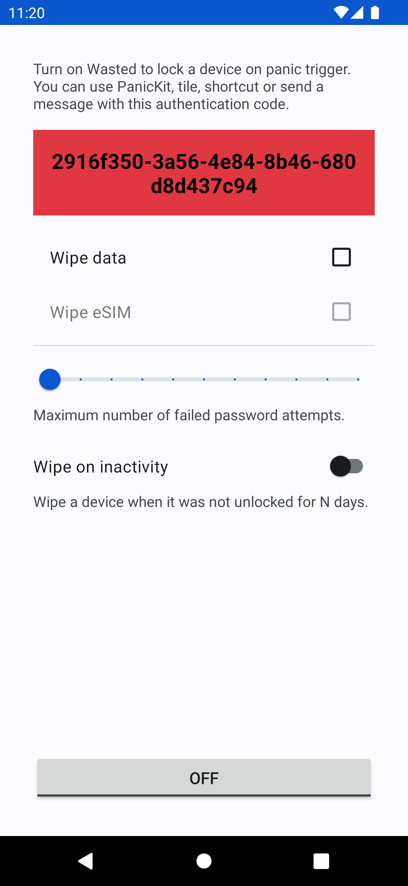

# Wasted

> [!WARNING]
> Because Google has already shifted the DevicePolicyManager API, the app architecture will be 
redesigned. The Device Policy features will become a standalone app acting as the Device Owner 
core, and the other apps will request the required functionality from it.

Lock a device and wipe its data on emergency.

You can use [PanicKit](https://guardianproject.info/code/panickit/), tile, shortcut or send a 
message with a secret code. On trigger, using 
[Device Administration API](https://developer.android.com/guide/topics/admin/device-admin), it 
locks a device and optionally runs wipe (factory reset). Or it can send a broadcast message 
instead of the wipe.

Also you can:
* fire when a device was not unlocked for X time
* fire when a USB data connection is made while a device is locked
* fire when a fake messenger app is launched
* fire when a duress password is entered (companion app: [Duress](https://github.com/x13a/Duress))

The app works in `Work Profile` too, but with limitations. Use it to install risky apps and 
`Wasted` in it. Then you can wipe this profile data with one click without wiping the whole device.

For base security take a look at: [Sentry](https://github.com/x13a/Sentry).  
Only encrypted device may guarantee that the data will not be recoverable.

Be aware that the app does not work in _safe mode_.

## Broadcast

* action: `me.lucky.wasted.action.TRIGGER`
* receiver: `me.lucky.wasted/.TriggerReceiver`
* also you have to send a secret code from Wasted with the key: `code`

## Permissions

* DEVICE_ADMIN - lock and optionally wipe a device
* FOREGROUND_SERVICE - receive lock and USB state events
* RECEIVE_BOOT_COMPLETED - persist lock job and foreground service across reboots

## Localization

## License

